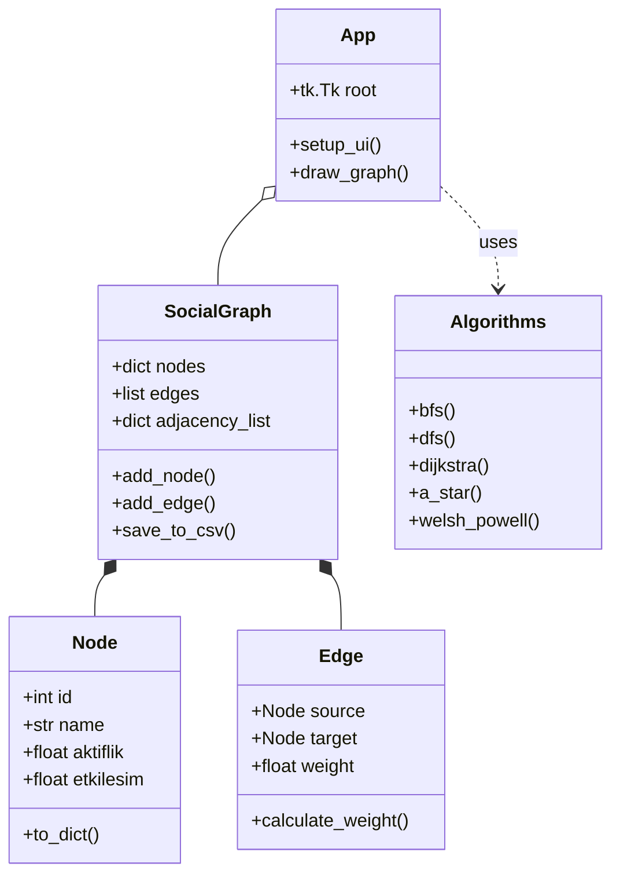

**Sosyal Ağ Analizi ve Görselleştirme Aracı**

**Ders:** Yazılım Geliştirme Laboratuvarı I – Proje 2

**Tarih:** 2 Ocak 2026

**Geliştiriciler:** [Sude Naz Lekesiz] , [Fatma Nilay Süzer]

1. Proje Özeti ve Amacı

Bu proje, kullanıcılar arasındaki ilişkileri bir graf yapısı olarak modelleyen, bu ilişkiler üzerinde çeşitli algoritmalar çalıştıran ve sonuçları etkileşimli bir grafik arayüz (GUI) üzerinde görselleştiren bir masaüstü uygulamasıdır.

Projenin temel amacı; Nesne Yönelimli Programlama (OOP) prensiplerine sadık kalarak, graf teorisi algoritmalarını (BFS, DFS, Dijkstra, A* vb.) gerçek hayat senaryosuna uygun bir sosyal ağ modeli üzerinde uygulamaktır.

Uygulama, düğümlerin aktiflik ve etkileşim puanlarına göre dinamik ağırlık hesaplaması yaparak statik olmayan, yaşayan bir ağ yapısı sunar.

2. Kullanılan Teknolojiler ve Mimari

Programlama Dili: Python

Arayüz: Tkinter

Görselleştirme: Canvas

Sınıf Yapısı (Class Diagram)

Proje, OOP prensiplerine uygun olarak modüler bir yapıda tasarlanmıştır. Aşağıdaki diyagram sınıflar arasındaki ilişkileri göstermektedir:

3. Gerçeklenen Algoritmalar ve Analizler

Uygulama içerisinde aşağıdaki algoritmalar ve analiz yöntemleri entegre edilmiştir:

3.1. Yol Bulma Algoritmaları

BFS (Breadth-First Search):
Ağ üzerindeki düğümleri genişlemesine arar. En az kenar sayısına sahip yolu bulmak ve ağın bağlantı durumunu kontrol etmek için kullanılır.

DFS (Depth-First Search):
Ağın derinliklerine inerek arama yapar. Bağlı bileşenlerin tespiti ve döngü kontrolü için kullanılmıştır.

Dijkstra:
İki kullanıcı arasındaki en düşük maliyetli yolu bulur. Kenar ağırlıkları kullanıcı benzerliklerine göre dinamik hesaplanır.

A* (A-Star):
Dijkstra’nın optimize edilmiş halidir. Aktiflik puanı farkı, sezgisel (heuristic) fonksiyon olarak kullanılır.

3.2. Ağ Analizi ve Görselleştirme

Merkezilik Analizi (Degree Centrality):
Ağdaki en popüler ve etkileşimi en yüksek kullanıcıları tespit eder.

Topluluk Tespiti (Connected Components):
Birbirinden kopuk kullanıcı gruplarını analiz eder.

Welsh-Powell Renklendirme:
Komşu düğümlerin farklı renkte olmasını sağlayarak grafın görsel karmaşıklığını azaltır.

4. Dinamik Ağırlık Hesaplama

İki düğüm arasındaki kenar ağırlığı sabit değildir. Aşağıdaki formülle hesaplanır:

$$Ağırlık_{i,j} = 1 + \sqrt{(Aktiflik_i - Aktiflik_j)^2 + (Etkileşim_i - Etkileşim_j)^2 + (Bağlantı_i - Bağlantı_j)^2}$$​

Mantık:
Özellikleri birbirine benzeyen kullanıcılar arasındaki mesafe küçüktür → ağırlık düşüktür.
Benzer olmayan kullanıcılar → daha yüksek ağırlık.

5. Kurulum ve Çalıştırma
Gereksinimler

Python 3.x

Standart kütüphaneler: math, random, csv, json, tkinter

(Opsiyonel) Ekran görüntüsü için:

pip install Pillow

Çalıştırma Adımları
python main.py

Uygulama açıldığında sol menüden CSV Yükle butonuna basarak veriler.csv dosyasını yükleyin.

6. Sonuç ve Değerlendirme

Bu proje kapsamında, graf algoritmaları somut bir sosyal ağ senaryosu üzerinde başarıyla uygulanmıştır.
Dinamik ağırlıklandırma sayesinde ağ yapısının yalnızca topolojik değil, kullanıcı özelliklerine göre de değiştiği gözlemlenmiştir.

Performans testlerinde 100 düğüme kadar olan ağlarda algoritmaların milisaniye seviyesinde sonuç verdiği görülmüştür.
Tkinter Canvas kullanılarak uygulanan Force-Directed yerleşim, karmaşık ağların görsel olarak daha anlaşılır olmasını sağlamıştır.

6.1 Test Sonuçları 

======================================================================
### 📊 PERFORMANS TESTLERİ: test_small_10.csv
======================================================================
Graf Boyutu: 10 düğüm, 24 kenar
Test Sayısı: 5 iterasyon

🔹 BFS
   Ortalama: 0.0258ms
   Min: 0.0181ms | Max: 0.0472ms
   start_node: 9
   nodes_visited: 10

🔹 DFS
   Ortalama: 0.0423ms
   Min: 0.0305ms | Max: 0.0606ms
   start_node: 7
   nodes_visited: 10

🔹 Dijkstra
   Ortalama: 0.2076ms
   Min: 0.0513ms | Max: 0.6790ms
   start_node: 3
   end_node: 10
   path_length: 2
   cost: 24.21

🔹 A*
   Ortalama: 0.1658ms
   Min: 0.1082ms | Max: 0.2470ms
   start_node: 10
   end_node: 2
   path_length: 3
   cost: 35.09

🔹 Degree Centrality
   Ortalama: 0.0203ms
   Min: 0.0129ms | Max: 0.0436ms
   top_nodes: 5
   max_degree: 7

🔹 Welsh-Powell
   Ortalama: 0.0704ms
   Min: 0.0563ms | Max: 0.0968ms
   nodes_colored: 10
   colors_used: 4

🔹 Connected Components
   Ortalama: 0.0251ms
   Min: 0.0188ms | Max: 0.0408ms
   num_components: 1
   largest_component: 10

✅ Graf yüklendi: 20 düğüm, 62 kenar

======================================================================
### 📊 PERFORMANS TESTLERİ: test_small_20.csv
======================================================================
Graf Boyutu: 20 düğüm, 62 kenar
Test Sayısı: 5 iterasyon

🔹 BFS
   Ortalama: 0.0445ms
   Min: 0.0317ms | Max: 0.0615ms
   start_node: 13
   nodes_visited: 20

🔹 DFS
   Ortalama: 0.3731ms
   Min: 0.0720ms | Max: 1.2028ms
   start_node: 6
   nodes_visited: 20

🔹 Dijkstra
   Ortalama: 2.0458ms
   Min: 0.4838ms | Max: 7.0205ms
   start_node: 4
   end_node: 6
   path_length: 3
   cost: 12.58

🔹 A*
   Ortalama: 0.8924ms
   Min: 0.1023ms | Max: 2.9793ms
   start_node: 18
   end_node: 19
   path_length: 2
   cost: 12.05

🔹 Degree Centrality
   Ortalama: 0.0352ms
   Min: 0.0236ms | Max: 0.0713ms
   top_nodes: 5
   max_degree: 9

🔹 Welsh-Powell
   Ortalama: 0.2887ms
   Min: 0.2353ms | Max: 0.3550ms
   nodes_colored: 20
   colors_used: 5

🔹 Connected Components
   Ortalama: 0.0771ms
   Min: 0.0467ms | Max: 0.1736ms
   num_components: 1
   largest_component: 20

✅ Graf yüklendi: 50 düğüm, 219 kenar

======================================================================
### 📊 PERFORMANS TESTLERİ: test_medium_50.csv
======================================================================
Graf Boyutu: 50 düğüm, 219 kenar
Test Sayısı: 5 iterasyon

🔹 BFS
   Ortalama: 0.1237ms
   Min: 0.1092ms | Max: 0.1349ms
   start_node: 41
   nodes_visited: 50

🔹 DFS
   Ortalama: 0.1807ms
   Min: 0.1674ms | Max: 0.2196ms
   start_node: 4
   nodes_visited: 50

🔹 Dijkstra
   Ortalama: 7.7244ms
   Min: 1.1148ms | Max: 12.8555ms
   start_node: 26
   end_node: 23
   path_length: 2
   cost: 45.01

🔹 A*
   Ortalama: 22.6927ms
   Min: 5.1467ms | Max: 74.5878ms
   start_node: 28
   end_node: 35
   path_length: 6
   cost: 48.79

🔹 Degree Centrality
   Ortalama: 0.0619ms
   Min: 0.0517ms | Max: 0.0973ms
   top_nodes: 5
   max_degree: 14

🔹 Welsh-Powell
   Ortalama: 5.8075ms
   Min: 1.1530ms | Max: 16.2287ms
   nodes_colored: 50
   colors_used: 6

🔹 Connected Components
   Ortalama: 0.1469ms
   Min: 0.1256ms | Max: 0.1664ms
   num_components: 1
   largest_component: 50

✅ Graf yüklendi: 100 düğüm, 589 kenar

======================================================================
### 📊 PERFORMANS TESTLERİ: test_medium_100.csv
======================================================================
Graf Boyutu: 100 düğüm, 589 kenar
Test Sayısı: 5 iterasyon

🔹 BFS
   Ortalama: 0.2988ms
   Min: 0.2418ms | Max: 0.4313ms
   start_node: 38
   nodes_visited: 100

🔹 DFS
   Ortalama: 5.1869ms
   Min: 0.5171ms | Max: 23.0415ms
   start_node: 3
   nodes_visited: 100

🔹 Dijkstra
   Ortalama: 96.7003ms
   Min: 22.6791ms | Max: 217.3049ms
   start_node: 16
   end_node: 97
   path_length: 3
   cost: 37.27

🔹 A*
   Ortalama: 180.9323ms
   Min: 101.0621ms | Max: 289.1250ms
   start_node: 40
   end_node: 55
   path_length: 3
   cost: 26.41

🔹 Degree Centrality
   Ortalama: 2.8959ms
   Min: 0.0837ms | Max: 7.9880ms
   top_nodes: 5
   max_degree: 18

🔹 Welsh-Powell
   Ortalama: 17.2666ms
   Min: 4.1108ms | Max: 66.6950ms
   nodes_colored: 100
   colors_used: 6

🔹 Connected Components
   Ortalama: 0.8716ms
   Min: 0.3579ms | Max: 1.2648ms
   num_components: 1
   largest_component: 100

======================================================================
✅ TÜM SONUÇLAR KAYDEDİLDİ: all_performance_results.csv
======================================================================

### 📊 ÖZET TABLO

| Algoritma              | 10 Düğüm   | 20 Düğüm   | 50 Düğüm    | 100 Düğüm   |
|------------------------|------------|------------|-------------|-------------|
| BFS                    | 0.03ms     | 0.04ms     | 0.12ms      | 0.30ms      |
| A*                     | 0.17ms     | 0.89ms     | 22.69ms     | 180.93ms    |
| DFS                    | 0.04ms     | 0.37ms     | 0.18ms      | 5.19ms      |
| Connected Components   | 0.03ms     | 0.08ms     | 0.15ms      | 0.87ms      |
| Dijkstra               | 0.21ms     | 2.05ms     | 7.72ms      | 96.70ms     |
| Degree Centrality      | 0.02ms     | 0.04ms     | 0.06ms      | 2.90ms      |
| Welsh-Powell           | 0.07ms     | 0.29ms     | 5.81ms      | 17.27ms     |

Welsh-Powell              0.07ms       0.29ms       5.81ms       17.27ms
